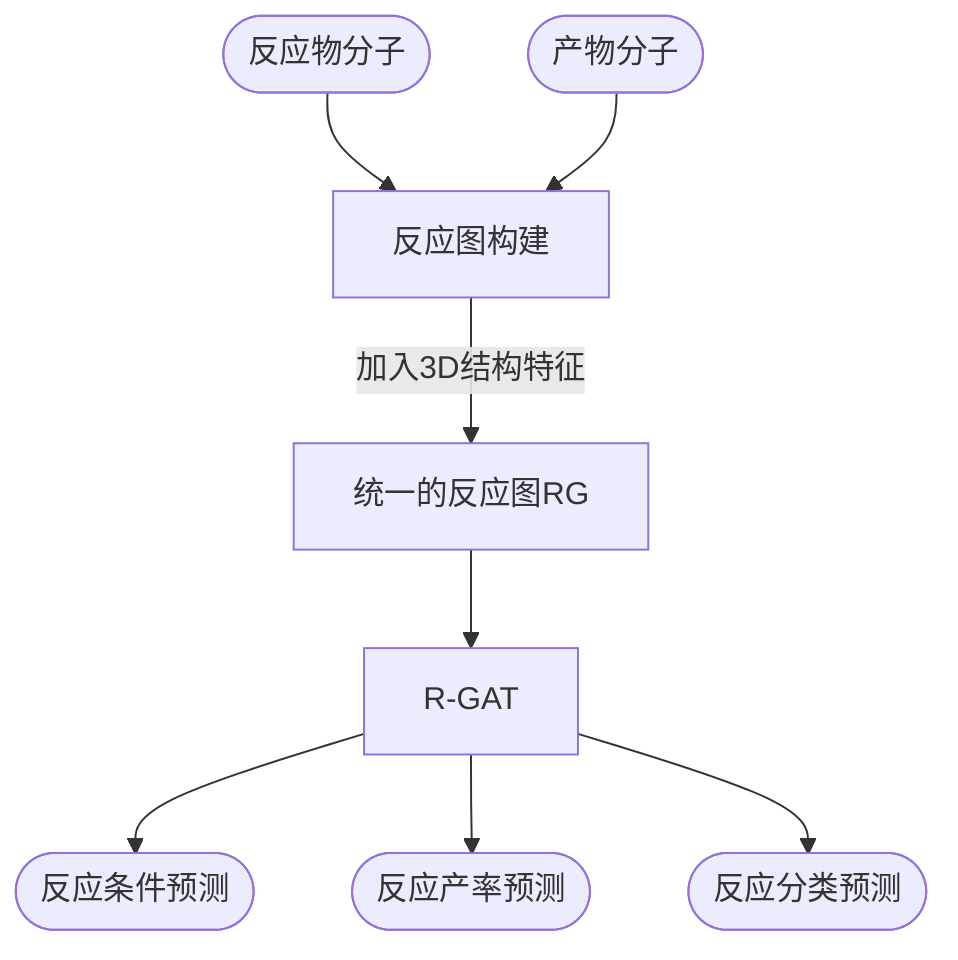

# 执行摘要

本论文提出了一种新的化学反应表示方法——**反应图（Reaction Graph, RG）**，将反应物和产物的分子图融合为一个统一的图结构，同时引入简单有效的三维结构信息。在此基础上，作者设计了**反应图注意力网络（R-GAT）**，通过多尺度注意力机制关注反应过程中的键结构变化，从而预测反应的性质。作者在化学反应分类、反应条件预测和产率预测等多项任务上进行了实验，使用了USPTO-条件、Pistachio-条件、USPTO-模版（TPL）、Pistachio-类型、USPTO-产率、HTE等共六个数据集。结果表明，所提方法在所有任务上均显著优于现有最先进方法，实现了最高的预测准确率。公开代码和数据进一步增强了工作可复现性。

# 论文讲解（面向研究生）

化学反应可以看作一系列**原子重排**的过程，即反应物中的原子经过断键和成键，重新形成产物。要用人工智能预测反应结果（如产率、产物类型或所需条件等），关键是建模分子间原子的相互作用和结构变化。然而传统的分子表示（如基于SMILES的序列模型或单个分子图神经网络）主要关注单个分子性质，往往忽略了反应前后多分子之间的联系及三维结构。

为了解决这一问题，论文引入了**反应图（RG）**这一新表示。在RG中，首先将反应物和产物的分子图拼接起来，然后通过**新增边**显式连接反应前后对应的同一原子（例如，使用映射关系将断裂键处的原子相连）。同时，为了利用分子的几何信息，RG还在图中添加了简单的几何特征，例如原子之间的距离或由分子构型确定的三角形关系（即在分子中连成三角的三个原子所形成的结构）。这种构造使得反应中的原子重排和局部三维结构都能在图中体现出来。 

在此基础上，作者设计了**反应图注意力网络（R-GAT）**。该网络输入反应图RG，使用图神经网络和多尺度注意力模块，重点关注那些在反应过程中键发生变化的区域，以及保持结构的部分。通俗地说，R-GAT可以自动“关注”反应图中键断裂和成键的原子对，以及与之关联的原子团，从而学习到有助于预测反应性质的结构表示。训练时，模型以带标记的反应数据（如反应条件、产率数据、反应类型等）作为监督信号，优化预测任务的准确度。

在实验中，作者使用了多个公开或自行清洗的大型化学反应数据集。例如，USPTO-Condition数据集（约68万条记录）来源于Parrot项目、Pistachio-Condition（约56万条）等，用于预测反应条件；USPTO-TPL（模板分类）和Pistachio-Type用于预测反应类型；USPTO-Yield和HTE数据用于预测反应产率。评价指标包括分类任务的Top-k准确率（例如条件预测中的Top-3准确率）和回归任务的决定系数R²等。

结果显示，在所有任务和数据集上，Reaction Graph + R-GAT方法均超过了已有的最先进模型。例如，在反应分类任务中，基于Transformer的模型已能达到98.2%的准确率；本工作进一步利用结构信息，使各项性能更优。在反应条件预测任务上，Parrot模型在USPTO-Condition数据集的Top-3准确率相比之前方法提高了13.4%；Reaction Graph方法结合图结构和3D信息后，进一步提升了准确率。在反应产率预测中，与基于卷积或序列模型的结果相比，新方法也展现出更好的拟合能力。

此外，作者还对方法进行了可解释性分析和消融研究。例如，表1显示，Reaction Graph比单独的分子图（Molecular Graph, MG）更容易识别“离去基团”（reaction leaving group），即反应中脱离的原子团。表3-表8进行了一系列对比：添加三维结构特征（如边长、键角等）后性能明显提升；同时，加入跨分子反应信息（Reaction Info）也提升了模型效果。这些实验表明，论文所提的反应图构造及三维信息是有效的。

**图示**：下面的流程图示意了Reaction Graph模型的基本流程，其中反应物和产物分子输入经过统一构图，然后经由R-GAT网络进行多任务预测： 

结果验证了：结合反应级别的图结构和简单的三维特征，模型在多种任务上均优于只考虑单分子或只基于序列的模型。

# 技术点评

**方法合理性与创新性：** 本文的主要贡献在于提出了一种新的反应级别图表示，将反应前后的分子图结合起来，并引入了3D结构信息。这一思路新颖，填补了现有方法只关注单分子或序列描述而忽略反应整体结构的空白。同时，R-GAT利用多尺度注意力来捕捉关键结构变化，也较好地契合了化学反应本质。例如，论文通过离去基团检测任务（表1）说明了RG相对传统单分子图更能学习到反应中心附近的原子变化信息，佐证了表示的有效性。

**可复现性和实现细节：** 作者已公开了代码和处理后的数据。从**GitHub**仓库可见，模型在PyTorch/DGL框架下实现，并提供了数据预处理脚本和参数。论文描述的反应图构建、网络结构与训练细节（例如损失函数、优化器参数等）在补充材料和代码中均有给出，有利于复现。值得注意的是，RG的构建需要反应物与产物之间的原子对应关系（atom-mapping），这对具体实现提出了要求。作者可能使用了现有的映射工具（如RXNMapper）来获取这一映射；而反应图中加入的3D信息则需要依赖分子构型（可能通过量化或启发式方法生成），这在实际应用中可能会增加计算复杂度。此外，数据集预处理（如Pistachio数据的清洗）虽在代码中提供，但涉及商业数据库的细节可能会影响复现。

**数据质量与偏差：** 论文使用的USPTO和Pistachio数据集规模较大，但这类数据通常质量参差不齐。比如化学专利数据中反应条件和产率记录可能不完整或存在实验误差，这会对模型学习带来噪声。对于产率预测，USPTO中的高通量实验（HTE）数据更可靠，但专利产率往往不够精确。此外，模型训练过程中不同反应类型或化学空间的分布不均可能导致偏差，例如某些常见反应占比高，模型可能过拟合于这些类型。在实验中，作者选择了多种数据集来评估，多方面验证了方法鲁棒性，值得肯定。然而，对少见反应或新颖反应的泛化能力仍需进一步探讨。

**假设与局限性：** 论文并未明确提及所有潜在假设，但从方法可推测：首先，RG假设反应物和产物的原子映射是正确且可得的；其次，3D结构特征假设以某种方式简化却不失重要性（如只取键长、键角等）。这些假设可能不适用于所有反应。例如，对高分子或过渡态等难以获取构型的体系，RG的构建受限。此外，RG目前只结合了静态结构信息，对反应动力学或溶剂效应等因素未建模。由于模型依赖于已有数据进行监督训练，训练数据中未包含的反应类型或条件，模型可能无法准确预测。最后，R-GAT的复杂性相对较高，在实际部署时可能需要考虑计算资源和推理速度等问题。

# 相关工作综述与未来展望

近年来，**化学反应预测**领域迅速发展，主要方向可分为三大类任务：反应**分类/表示**、**条件预测**和**产率预测**。以下比较几种代表性工作：

| 方法 (年份)             | 模型 / 表示              | 任务                     | 数据集 / 特征     | 核心思想 / 性能                                  |
|------------------------|--------------------------|--------------------------|-------------------|--------------------------------------------------|
| **Schwaller et al., NMI 2021** | Transformer（基于SMILES） | 反应分类                 | Schneider50k, Pistachio（文本） | 使用无监督预训练的Transformer，数据驱动地学习反应指纹，分类准确率达98.2%。 |
| **Wang et al., Research 2023 (Parrot)** | Transformer + 预训练      | 反应条件（催化剂、溶剂、温度）预测 | USPTO-Condition, Reaxys-Condition 等 | 设计了可解释的Transformer结构和预训练策略，提升Top-3准确率13.4%，温度预测MAE降低约4°C。 |
| **Chen et al., AAAI 2023 (TRACE)**  | 图神经网络（TRACE）      | 反应条件预测             | 专门构建的条件数据集 | 原子级联合反应物和产物图，构建动态交互图来预测条件，强调反应转变信息。 (相关报道) |
| **Wang et al., Chem. Sci. 2025 (Reacon)** | GNN + 模板 + 聚类         | 反应条件预测             | USPTO-Condition（清洗版） | 结合反应模板和聚类思想，Top-3准确率达63.48%；在簇内回忆率更高（85.65%）。 |
| **van Gerwen et al., J. Chem. Inf. Model. 2024 (3DReact)** | 等变/不变几何GNN（3D）    | 反应性质预测（活化能）   | GDB7-22-TS, Cyclo-23-TS 等   | 引入分子几何对称性，使用反应物和产物的三维结构预测反应的活化能，模型在插值/外推任务中性能稳定。 |
| **Jiang et al., J. Cheminf. 2024**    | 定制的反应图（Buchwald–Hartwig） | 反应产率预测             | Buchwald–Hartwig 反应数据集 | 设计专门的反应图以捕捉该类型反应的结构特征，显著提高产率预测精度。 |
| **本工作 (Jian et al., ICML 2025)** | 反应图（RG） + R-GAT    | 多任务（分类/条件/产率） | USPTO/Pistachio条件、TPL、类型、产率、HTE | 引入统一的反应图表示，兼顾键重排与3D结构；实现所有任务上的SOTA性能。 |

可以看出，本工作试图整合前人各类想法：它像TRACE和Reacon一样构建跨分子图，又引入了3D几何特征类似3DReact，同时承载了Parrot和Schwaller等工作的多任务性质。相比之下，Reaction Graph是一种更统一的方法，一种模型框架可以同时用于多个反应预测任务。

**开放问题与挑战：** 目前方法多数依赖于**静态表示**和已有数据，未来仍有许多值得探索的方向。例如：  
- **时序/动力学信息**：真实反应是动态过程，如何将反应路径上的瞬态结构或动力学信息融入模型？  
- **多模态融合**：除了结构信息，反应还涉及实验环境（溶剂、电化学条件等）。能否结合实验条件文本、图像（如分子图谱）等多模态数据来提高预测？  
- **数据稀缺与泛化**：对于新颖反应或低丰度反应类型，目前模型可能难以迁移。一方面，需要构建更多多样化、开放的反应数据集；另一方面，也可研究无监督/自监督预训练策略，提升模型对未见反应的泛化能力。  
- **因果与解释**：深度模型多为“黑盒”，目前虽有注意力可视化作为启发，但能否提炼出更明确的化学反应机理知识？例如，将模型学到的表征与实际化学机制联系起来，是一个重要课题。  
- **合成规划集成**：目前方法主要做预测，未来可与逆合成规划工具（如自动化反向合成树搜索）集成，实现可解释地推荐反应路径及条件。

**未来方向展望：** 随着AI技术与化学领域的融合，将可能出现更多创新架构和范式：  
- **更精细的图建模**：比如区分不同类型的键变化，对共轭体系或金属催化反应设计专门的图结构。  
- **结合量子化学**：将第一性原理计算结果引入学习过程，如利用反应势能面数据增强模型物理感知。  
- **迁移学习与大模型**：借鉴语言模型领域经验，训练大规模的通用反应模型，可在多个下游任务微调使用。  
- **实验闭环**：与高通量实验(HRS)平台结合，实现模型-实验互助，即模型指导实验验证，实验结果反馈优化模型。  
- **交互式平台**：作者提到已提供在线平台供反应分析，这类工具可进一步发展，让化学家与模型交互探索反应空间（如可视化反应指纹图谱等）。

**总之**，该论文在化学反应图神经网络领域提出了一种综合性强的方法，通过创新性的反应图表示和专门的神经网络结构，实现了对多个任务的统一建模和性能提升。未来的工作可在此基础上继续探索更丰富的反应信息和跨任务的学习策略，以推动化学人工智能预测的准确性和实用性提升。

